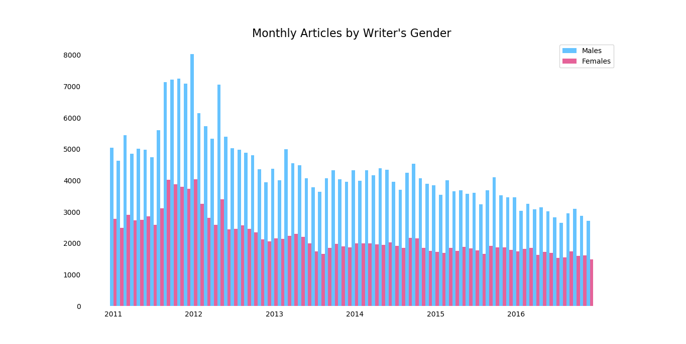

# A Newspaper for Men
## A study on the gender distribution of writers at the New York Times

We all read news with implicit biases. From our own political views to those of the company's and reporter's, attempting to escape political, social, or other frames is futile. That is, frames dissuade us from thinking, or nudge us toward predetermined thought patterns. Whether we’re watching a fifteen-second TV ad or reading a carefully laid-out newspaper, the frame imposed on the content affects how we receive it. In news, the sum of our experiences preceding *what* we read determines *how* we read it. We know this, and many actively try to read works from both the left and right. This leads to my question: **Why don't we recognize these same frames in gender?**

We each view the world through our own set of internal frames, shaped by every experience we’ve had and every word we’ve heard and uttered. Men and women have internal differences that create biological disparities, affecting their outlooks and how they shape their news. More importantly, the social landscapes for men and women are vastly different: from how they're raised, how they're spoken to, and societal pressures placed on them, men and women view the world through different lenses. And if only one gender reports information, we only see one side of the truth.

My study reviews *The New York Times*, widely considered the paragon of the news industry, to determine whether there an equally distributed number of men and women write their articles.

## Data Collection

I analyzed every New York Times article written over the last 7 years, which summed to be over 350,000 articles. From each article, I took the first name of the author and the "section_type," a self-defined topic that the New York Times attributed to the article.

From there, I had to determine the gender of the articles' authors. This proved difficult, since The Times did not directly say the gender of reporters. Currently I am using an algorithm predicated on artificial intelligence that searches through the US Social Security name database to predict gender.

## Analysis

A male dominated field

Analysis on figure one (only a paragraph)

> The largest gap between genders was in April, 2016, when *78% of all articles were written by men*

Line graph (second figure) would go here

Analysis on figure two (only a paragraph)

## Citations

 - All data gathered using the New York Times Developer API
 - Miles McCain for answering some of my questions
 - Sephen Holiday [@sholiday](https://github.com/sholiday) for the framework for the Gender Predictor
 - Name database provided by the [US Social Security Administration](https://www.ssa.gov/oact/babynames/limits.html)
